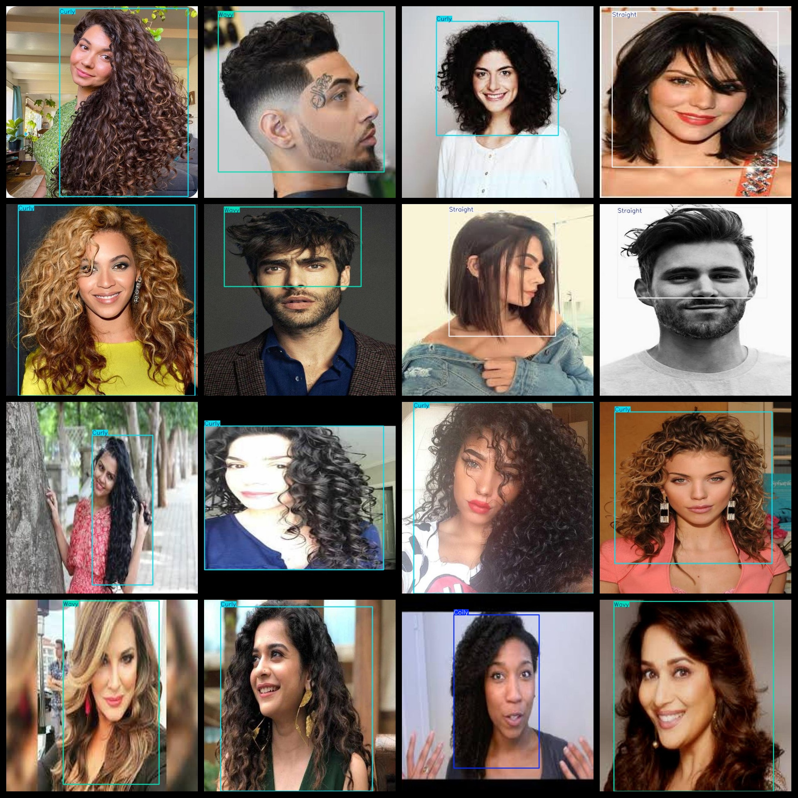
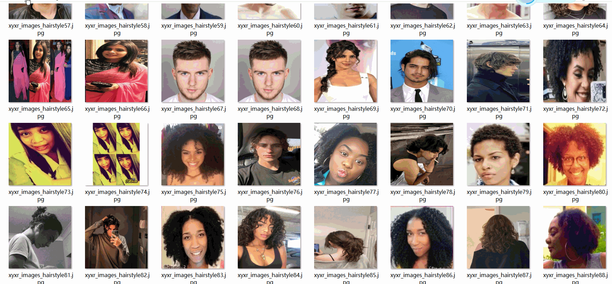

# 4 typesHair Genre Detection Dataset 4347 imagesVOC+YOLO format

4 hairstyle detection datasets 4347 VOC + YOLO formats

Dataset format: Pascal VOC format + YOLO format (the txt file does not contain the split path, it only contains jpg images and corresponding VOC format xml files and yolo format txt files)

Number of images: 4347

Number of xml files: 4347

Marked the number of txt files: 4347

Number of annotated categories: 4

The Github repository is: datasets_sl

["Coily", "Curly", "Straight", "Wavy"]

Number of boxes labeled in each category:

Coily frame count = 1010 (tight roll / spring roll)

Curly Frames = 1156 (curly)

Straight frame number = 1292 (straight)

Wavey frame count = 1027

Total Frames: 4485

Number of images per category:

Coily owns 1007 pictures.

Curly occupies 1117 pictures.

Straight occupancy rate = 1234

Wavey occupies 1002 pictures.

Image resolution: 640x640

Use the labeling tool: labelImg

Dataset Augmentation: Yes

Rules for annotation: Draw a rectangle around the category.

Important note: The dataset does not have been divided into training, validation, and testing sets.

Special Disclaimer: This dataset does not guarantee the accuracy of the trained models or weight files.

Annotation and image details are as follows:

## Images

---

Here is a pay link on Stripe (https://buy.stripe.com/3cs8yP7sY87d0vu9AB). Please contact me lonlonago@foxmail.com after funding $89, and I will send you a complete data files, thank you!

